# Esercizio — Scheduling Overhead RoundRobin

tipo: compito | correzione
tempo: 15 min

## Testo

Si consideri un sistema **time-sharing** che esegue **N processi sempre pronti**.
I processi:

- non terminano
- non vanno mai in attesa
- si alternano ciclicamente sulla CPU

Lo scheduler utilizza una politica **Round Robin** con:

- **Q** = quanto di tempo (time slice)
- **Tcsw** = tempo di context switch (dispatch latency)

Si considerino i seguenti **scenari**:

#### Scenario 1

N = 2, Q = 10 ms, Tcsw = 1 ms

#### Scenario 2

N = 2, Q = 100 ms, Tcsw = 1 ms

#### Scenario 3

N = 100, Q = 10 ms, Tcsw = 1 ms

#### Scenario 4

N = 100, Q = 10 ms, Tcsw = 100 ns

## Richieste

1. **Disegnare** il grafico temporale dell'attività dello scheduler (timeline ciclica)

2. **Per ciascuno scenario clcolare:**
    a) Tempo di ciclo dello scheduler, ovvero il tempo necessario affinché tutti i processi vengano eseguiti una volta
    b) Tempo di CPU ricevuto da ciascun processo per secondo:
    c) Percentuale di CPU per processo
    d) Overhead dello scheduler
    e) Tempo di attesa tra due esecuzioni consecutive
    f) Tempo di risposta percepito

3. **Confrontare sinteticamente i risultati e rispondere:**

    a) **Dimensione del quanto di tempo**
    Confrontando gli scenari proposti, come varia la percentuale di overhead al variare di Q a parità di Tc?
    Quale relazione emerge tra reattività del sistema e valore del quanto?
    b) **Numero di processi e tempo di attesa**
    Come varia il tempo di attesa tra due esecuzioni consecutive dello stesso processo all’aumentare di N?
    Quali conseguenze ha questo sulla reattività percepita dai processi interattivi?
    c) **Scelta del quanto in funzione del carico**
    Se il numero di processi N aumenta, conviene mantenere Q fisso oppure ridurlo?
    Discutere il compromesso tra:
        - overhead dovuto ai context switch
        - tempo di risposta dei processi
    e indicare quale condizione dovrebbe valere tra Q e Tc per un buon funzionamento del sistema.

## Soluzione

### 1. Grafico temporale dello scheduler (timeline ciclica)

```mermaid

---
displayMode: compact
---

gantt
title RR Scenario 1 - N=2 Q=10ms Tc=1ms
dateFormat x
axisFormat %L

section CPU
    P1 : active , 0, 10
    Tc : crit, 1ms
    P2 : 10ms
    Tc : crit, 1ms
    P1 : active, 10ms
    Tc : crit, 1ms
    P2 : 10ms
    Tc : crit, 1ms
    P1 :  active , 10ms
    Tc : crit, 1ms
    P2 : 10ms
```

```mermaid
---
displayMode: compact
---

gantt
title RR Scenario 2 - N=2 Q=100ms Tc=1ms
dateFormat x
axisFormat %L

section CPU
    P1 : active, 0, 100
    Tc : crit, 1ms
    P2 : 100ms
    Tc : crit, 1ms
    P1 : active, 100ms
    Tc : crit, 1ms
    P2 : 100ms
    Tc : crit, 1ms
    P1 : active, 100ms
    Tc : crit, 1ms
    P2 : 100ms
```

```mermaid
---
displayMode: compact
---

gantt
title RR Scenario 3 - N=100 Q=10ms Tc=1ms
dateFormat x
axisFormat %L

section CPU
    P1 : active, 0, 50
    Tc : crit, 1ms
    P2 : 50ms
    Tc : crit, 1ms
    P3 : 50ms
    Tc : crit, 1ms
    P4 : 50ms
    Tc : crit, 1ms
    P5 : 50ms
    Tc : crit, 1ms
    P6 : 50ms
```

```mermaid
---
displayMode: compact
---

gantt
title RR Scenario 4 - N=100 Q=10ms Tc=0.1ms
dateFormat x
axisFormat %L

section CPU
    P1 : active, 0, 50
    Tc : crit, 1ms
    P2 : 50ms
    Tc : crit, 1ms
    P3 : 50ms
    Tc : crit, 1ms
    P4 : 50ms
    Tc : crit, 1ms
    P5 : 50ms
    Tc : crit, 1ms
    P6 : 50ms
```

### 2. Calcoli
Ripassiamo le formule:

a) Tempo di ciclo dello scheduler, ovvero il tempo necessario affinché tutti i processivengano eseguiti una volta:

    `Tcycle = N · (Q + Tcsw)`

b) Tempo di CPU ricevuto da ciascun processo per secondo:

    `CPU/sec = Q / Tcycle`

c) Percentuale di CPU per processo

    `%CPU = Q / Tcycle · 100`

d) Overhead dello scheduler

    `Overhead = Tcsw / (Q + Tcsw) · 100`

e) Tempo di attesa tra due esecuzioni consecutive

    `Tw = (N − 1) · (Q + Tcsw)`

f) Tempo di risposta percepito. Per processi interattivi:

    `Tr = Tw + Q`

1. **Dimensione del quanto di tempo**
    Al variare di Q a parità di Tc, la percentuale di overhead diminuisce all’aumentare di Q, poiché il numero di context switch per unità di tempo diminuisce. Tuttavia, un Q troppo grande può aumentare il tempo di risposta dei processi interattivi, rendendo il sistema meno reattivo.
    - **Numero di processi e tempo di attesa**
    All’aumentare di N, il tempo di attesa tra due esecuzioni consecutive dello stesso processo aumenta, poiché ogni processo deve attendere che gli altri completino i loro time slice. Questo può portare a una percezione di scarsa reattività nei processi interattivi.
    - **Scelta del quanto in funzione del carico**
    Se N aumenta, potrebbe essere necessario ridurre Q per mantenere una buona reattività, ma questo aumenterebbe l’overhead dovuto ai context switch. Un buon compromesso si ottiene quando Q è significativamente maggiore di Tc (ad esempio, Q > 10 * Tc) per minimizzare l’overhead mantenendo una buona reattività.
