# Esercizio — Scheduling Overhead RoundRobin

tipo: compito | correzione
tempo: 15 min

## Testo

Si consideri un sistema **time-sharing** che esegue **N processi** sempre pronti: non terminano e non vanno in attesa, ma si alternano in continuazione.
Lo scheduler utilizza una politica **Round Robin** dove:

- **Q** = quanto di tempo (time slice)
- **Tc** = tempo di context switch

Si considerino i seguenti **scenari**:

    Scenario 1: N = 2, Q = 10 ms, Tc = 1 ms
    Scenario 2: N = 2, Q = 100 ms, Tc = 1 ms
    Scenario 3: N = 100, Q = 50 ms, Tc = 1 ms
    Scenario 4: N = 100, Q = 10 ms, Tc = 100 ns

## Richieste

1. Disegnare il grafico temporale dell'attività dello scheduler (timeline ciclica)
2. Calcolare:

    - il tempo di CPU per processo in un ciclo
    - il tempo di ciclo dello scheduler
    - l'overhead totale
    - la percentuale di overhead

3. Confrontare sinteticamente i risultati e rispondere:

    - **Dimensione del quanto di tempo**
    Confrontando gli scenari proposti, come varia la percentuale di overhead al variare di Q a parità di Tc?
    Quale relazione emerge tra reattività del sistema e valore del quanto?
    - **Numero di processi e tempo di attesa**
    Come varia il tempo di attesa tra due esecuzioni consecutive dello stesso processo all’aumentare di N?
    Quali conseguenze ha questo sulla reattività percepita dai processi interattivi?
    - **Scelta del quanto in funzione del carico**
    Se il numero di processi N aumenta, conviene mantenere Q fisso oppure ridurlo?
    Discutere il compromesso tra:
        - overhead dovuto ai context switch
        - tempo di risposta dei processi
    e indicare quale condizione dovrebbe valere tra Q e Tc per un buon funzionamento del sistema.

## Soluzione

1. Grafico temporale dello scheduler (timeline ciclica):

```mermaid

---
displayMode: compact
---

gantt
title Round Robin — N=2 Q=10ms Tc=1ms
dateFormat x
axisFormat %L

section CPU
    P1 : p1, 0, 10
    Tc : crit, 1ms
    P2 : 10ms
    Tc : crit, 1ms
    P1 : 10ms
    Tc : crit, 1ms
    P2 : 10ms
    Tc : crit, 1ms
    P1 : 10ms
    Tc : crit, 1ms
    P2 : 10ms
```

